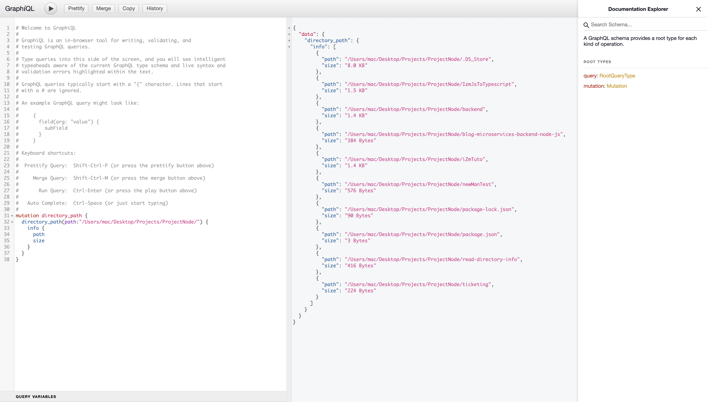

# Getting Started

the stack i wroked with:

Node, express, graphql
## What you need

Node installed in your machine:
[Node js guide](https://nodejs.org/en/download/)
## Available Scripts

In the project directory, you can run:

### `npm start`

Runs the backend in production mode.\
Open [http://localhost:5000/graphql](http://localhost:5000/graphql) in postman.
### `npm run dev`

run backend in dev mode you can test it on graphqli playground Open [http://localhost:5000/graphql](http://localhost:5000/graphql) in browser.

## Docker link
[shared docker link](https://hub.docker.com/repository/docker/youssefsamih/read-directory-info)